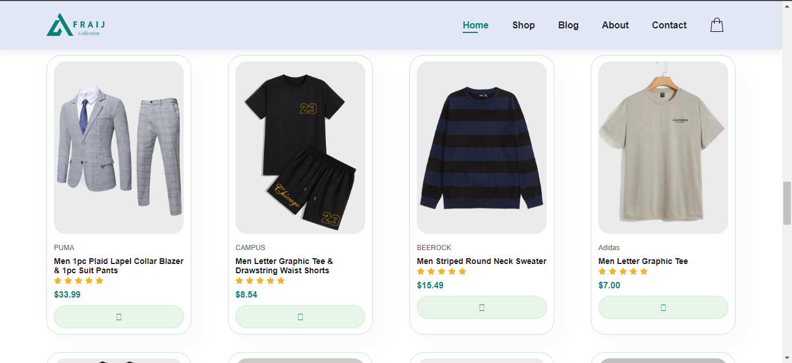
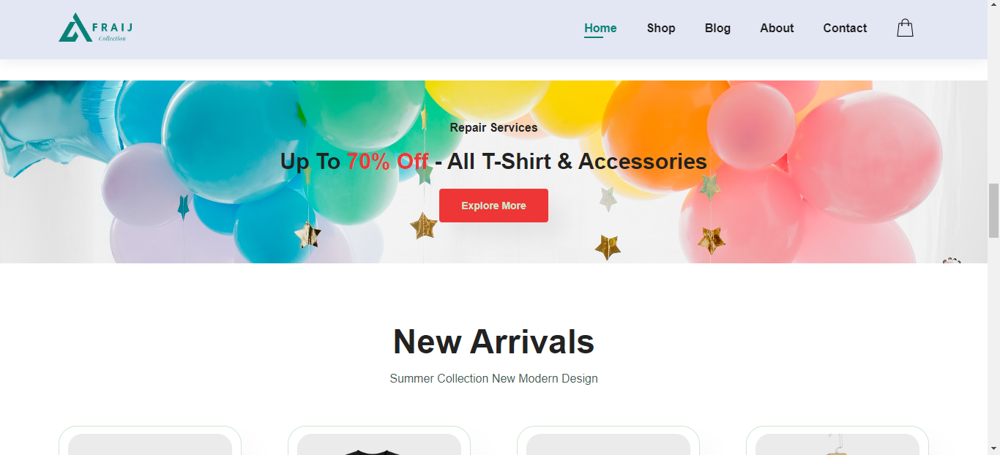
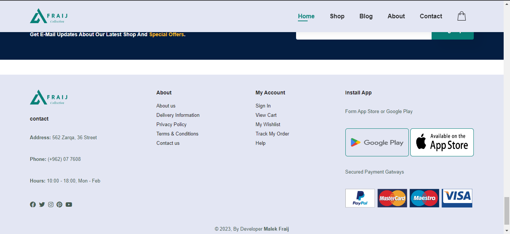

 

 
 <a href="https://github.com/MALEK-FRAIJ/Fraij-ecommerce-website-shopping.git">
 
# Fraij-ecommerce-website-shopping

It is a simple project for selling clothes over the Internet and is a practical application of what I learned in interface design using HTML, where an interface is designed that simulates electronic design websites.

# Fraij-ecommerce-website-shopping Logo

# list

- [Introduction](#introduction)
- [Fraij-ecommerce-website-shopping Snapshot](#fraij-ecommerce-website-shopping-snapshot)
- [About For Fraij-ecommerce-website-shopping ](#fraij-ecommerce-website-shopping )

# Introduction 

It is a simple project for selling clothes over the Internet and is a practical application of what I learned in interface design using HTML, where an interface is designed that simulates electronic design websites.

# Fraij-ecommerce-website-shopping Snapshot

### Fraij-ecommerce-website-shopping

### Headre and Nav-bar

### Services 

### Cart-Shopping

### Banner

### Footer

# About For Fraij-ecommerce-website-shopping

You can improve that page by adding many features, for example, supporting many languages and adding night mode, as the interface is designed to be a responsive design, and you can add many responsive designs and add many services.

